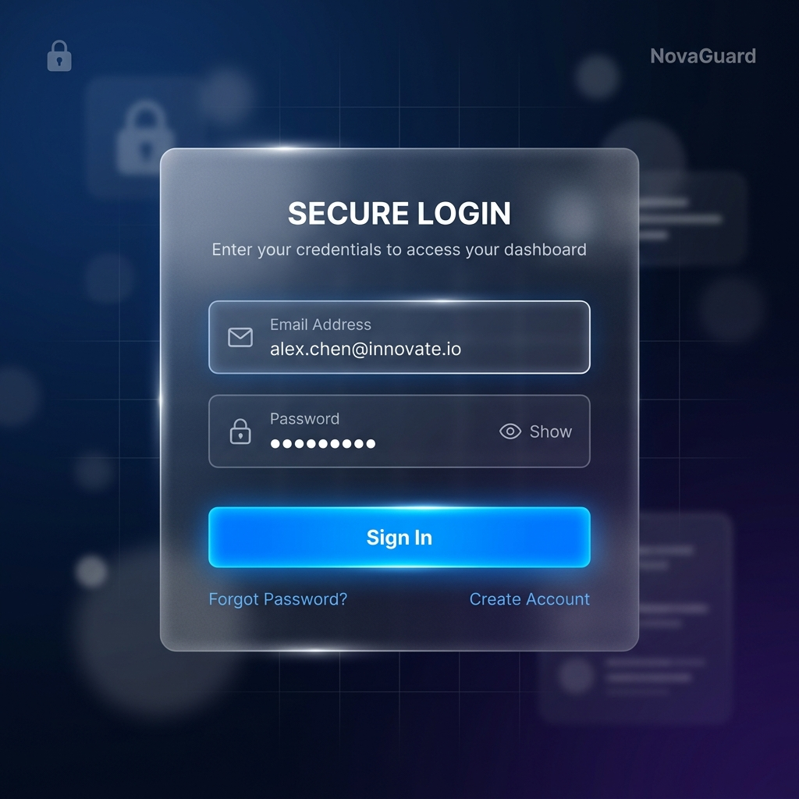

# SoftGrowTech - Secure Authentication Portal

This is a complete, professional backend development project built for the **SoftGrowTech Internship Task 2**. It demonstrates a highly secure, modern, and robust User Authentication System.

## 🚀 Project Overview

The "Secure Authentication Portal" is a full-stack web application designed to handle user registrations, secure logins, session management, and access control. It features a premium, modern dark-themed UI with glassmorphism aesthetics, built using Bootstrap 5.

### 🖼️ Sample Preview


## ✨ Features

- **User Registration**: Secure sign-up with email and strong password validation.
- **User Login/Logout**: Seamless authentication flow.
- **Password Hashing**: Bank-grade security using `Flask-Bcrypt`.
- **Session Management**: Persistent and secure user sessions using `Flask-Login`.
- **Protected Dashboard**: Routes that require authentication to access.
- **Responsive UI**: Mobile-friendly, dark-themed interface with stunning aesthetics.
- **Error Handling**: Graceful error messages and flash notifications.
- **Validation**: Strict duplicate account prevention and input sanitization.

## 🛠️ Technologies Used

- **Backend Framework**: Python, Flask
- **Database**: SQLite, Flask-SQLAlchemy
- **Authentication**: Flask-Login, Flask-Bcrypt
- **Frontend**: HTML5, CSS3, JavaScript
- **UI Framework**: Bootstrap 5

## ⚙️ Project Structure

```
SoftGrowTech_Auth_System/
│
├── app.py                  # Main application factory and server
├── requirements.txt        # Python dependencies
├── README.md               # Project documentation
├── config.py               # Application configuration
│
├── models/
│   └── user_model.py       # SQLAlchemy database models
│
├── routes/
│   └── auth_routes.py      # Authentication routes (Blueprint)
│
├── templates/
│   ├── base.html           # Master layout template
│   ├── index.html          # Landing page
│   ├── login.html          # Sign-in page
│   ├── register.html       # Sign-up page
│   └── dashboard.html      # Protected user dashboard
│
├── static/
│   ├── css/
│   │   └── style.css       # Custom styling (Glassmorphism, variables)
│   └── js/
│       └── main.js         # Client-side form validation
│
└── database/               # SQLite database directory
```

## 🔐 Authentication Flow

1. **Registration**: User inputs details -> Backend validates data (strong password, unique email/username) -> Password is hashed using Bcrypt -> User saved to database.
2. **Login**: User inputs credentials -> Backend queries database -> Validates Bcrypt hash against stored password -> Generates secure session cookie via Flask-Login.
3. **Protected Routes**: Dashboard checks for `@login_required` decorator -> Verifies active session -> Grants access or redirects to login.

## 💻 Installation & Setup Guide

### 1. Prerequisites
Ensure you have Python 3.8+ installed on your system.

### 2. Clone/Download the Project
Open VS Code and navigate to the project directory.

### 3. Create a Virtual Environment (Recommended)
```bash
python -m venv venv
```
Activate the environment:
- **Windows**: `venv\Scripts\activate`
- **Mac/Linux**: `source venv/bin/activate`

### 4. Install Dependencies
```bash
pip install -r requirements.txt
```

### 5. Run the Application
The database (`users.db`) will be created automatically upon the first run.
```bash
python app.py
```
The server will start on `http://127.0.0.1:5000`.

## 📤 GitHub Upload Steps

1. Initialize Git in the project directory: `git init`
2. Create a `.gitignore` file and add `venv/`, `__pycache__/`, and `.env` (if applicable).
3. Stage all files: `git add .`
4. Commit the changes: `git commit -m "Initial commit: Complete User Authentication System"`
5. Create a new repository on GitHub.
6. Link the local repository to GitHub: `git remote add origin <your-repo-url>`
7. Push the code: `git push -u origin main`

---
*Developed for SoftGrowTech Internship Task 2*
